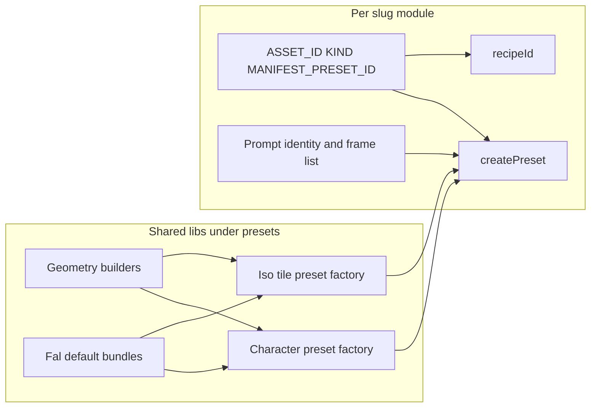

# Preset file structure: less duplication, faster variants

## Canonical baseline (`origin/main`)

Sprite preset modules are **already TypeScript** on **`origin/main`**: [`registry.ts`](tools/sprite-generation/presets/registry.ts) discovers **`presets/<slug>/<slug>.ts`** only (no `presets/lib/` yet). Slugs today: **`avatar-character`**, **`dpad`**, **`isometric-open-floor`**. Implementation and review should treat **`origin/main`** as the merged contract even when a local worktree cannot check out a local **`main`** branch.

**Worktree vs `origin/main` (short):** In this repo snapshot, `tools/sprite-generation/presets/` matches **`origin/main`**; unrelated edits may exist elsewhere (e.g. tickets). Do not assume drift in preset files without diffing.

## Current state (what we are simplifying)

- Each asset remains a **registry module** at `presets/<slug>/<slug>.ts` (see [`avatar-character.ts`](tools/sprite-generation/presets/avatar-character/avatar-character.ts) for a reference layout) exporting the full [`SpritePresetModule`](tools/sprite-generation/preset-contract.ts) surface: `ASSET_ID`, `MANIFEST_PRESET_ID`, `KIND`, optional `DEFAULT_STRATEGY`, `createPreset`, **`recipeId`**.
- [`PipelinePreset`](tools/sprite-generation/pipeline.ts) already separates **mock** (`generatorConfig`: `tileBufferForFrame`, `sheetLayout`), **live** (`prompt`, `fal`, `sheet`), and **game output** (`spriteRef`, dimensions on `sheet` / tile size fields).
- **Duplication** today: repeated horizontal-strip patterns (`SHEET_WIDTH`, `SHEET_CROPS`, `frameSheetCells`, `sheetLayoutFromCropsRect`), repeated fal “nano-banana sheet extras” shapes, repeated `createPreset` boilerplate (validation loops, provenance defaults), and parallel prompt constants that should evolve together across characters.
- **Canonical world/camera math** for isometric already lives in [`src/dimensions.ts`](src/dimensions.ts) (re-exported via [`gameDimensions.ts`](tools/sprite-generation/gameDimensions.ts)): footprint **W**, foreshortened floor **W/2**, tiered square cells (`floorOnly` / `halfHeight` / `fullHeight`), character walk **2:5** cells. Tile presets should **derive** texture width/height from here, not restate unrelated literals.

## TypeScript types, exports, and tests for `presets/lib/*`

The migration to `.ts` preset modules is **done** on **`origin/main`**; this refactor adds **shared library** files. To keep the tree maintainable:

- **Exported types** for inputs/outputs of pure builders (e.g. sheet-spec crop maps, row-major grid descriptors, validated frame→cell maps) and for **prompt bundles** (grouped strings passed into factories, separate from mock generators).
- **Alignment with pipeline types**: factories should compose [`PipelinePreset`](tools/sprite-generation/pipeline.ts) (and nested `prompt` / `fal` / `sheet` shapes) using existing interfaces where possible—avoid widening **factory arguments and builder returns** to `unknown`. Note `PipelinePreset["fal"]` already uses `Record<string, unknown>` for fal extras blobs; use **`const` + `satisfies`** and small typed helpers at the lib boundary rather than pretending the whole fal object is fully strict today.
- **Tests**: prefer colocated **`presets/lib/*.test.ts`** for pure builders (**`tools/**/*.test.ts`** is already picked up by Vitest). Use **inline expected objects** or small fixtures in test files for golden geometry (exact literals live next to the test). Keep **integration** coverage via existing [`pipeline.test.ts`](tools/sprite-generation/pipeline.test.ts) / registry tests after each preset refactor step.
- **Registry rule unchanged**: only **`presets/<slug>/<slug>.ts`** is a preset module; `lib/` files are imported helpers, not registry entries. **Do not** add `presets/lib/lib.ts` (that would register a slug named `lib`).

## Design principles

1. **Single source of truth per axis**
   - **Geometry** (cell size, sheet pixel size, crops, grid cells, mock `sheetLayout`): computed once from `(frame order, cell W×H, layout strategy)` so mock and live stay aligned ([`sheet-layout.ts`](tools/sprite-generation/sheet-layout.ts) stays the compositor).
   - **Prompt / fal tuning** (appearance, clothing, rewrite seeds, per-frame copy): grouped in a **prompt bundle** object imported into `createPreset`, **not** duplicated into mock code (mock stays cheap and deterministic).
   - **Registry identity**: still only in the per-slug file (`ASSET_ID`, `MANIFEST_PRESET_ID`, `KIND`) so discovery and paths stay obvious.
2. **Variable frame counts (characters) and `sheetGridSize`**
   - Treat `frames: GeneratorFrame[]` as authoritative; derive **`sheet.columns` / `sheet.rows`**, **`sheetGridSize`**, and crop maps from the same ordered list where those concepts align.
   - **Horizontal strip** (e.g. character walk): tie **`sheetGridSize`** and **`sheet.columns`** to **`frames.length`** (single row).
   - **Grids** (e.g. dpad 2×2): **`sheetGridSize`** is the **prompt/rewrite grid parameter** for that preset (today **`2`** for dpad, not `frames.length`). Do not assume `sheetGridSize === frames.length` for every layout—match each preset’s existing `build*Grid*Prompt` / rewrite contract when refactoring.
   - Horizontal strip remains one layout **strategy**; a future multi-row sheet would be a second strategy with its own builder.
3. **Tiles: shared isometric behavior + layered sizes**
   - **Shared**: rhombus floor semantics, footprint **W**, foreshortened band **W/2**, anchor insets — already centralized in [`src/dimensions.ts`](src/dimensions.ts).
   - **Per preset height / tier**: select **`floorOnly`** vs **`halfHeight`** vs **`fullHeight`** (or explicit `cellWidth`/`cellHeight` derived via `isoSquareCellSizePx(tier)`) so “walls vs floors” differ only in **tier + prompt/mock renderer**, not in conflicting duplicate constants.
   - **Camera vs world**: keep deriving pixel sizes from **`TILE_WORLD_M`** and **`PX_PER_WORLD_M`** (or documented helpers) so there is no second conflicting “screen height” constant in a preset file.
4. **Game loading / animation**
   - The pipeline already minimizes per-asset wiring via **`sprite-ref.json`** (`gridFrameKeys`, grid cell size). The plan is to keep **game-facing animation naming** (`frame` ids) stable and documented in the preset’s `frames` list; optional follow-up (separate from this refactor) is a small **`src/`** helper that maps an asset kind to default animation keys—only if you want less duplication in gameplay code. This refactor focuses on **preset-side** composition.

## Proposed file layout (no change to registry discovery rules)

Add a **shared** directory: [`tools/sprite-generation/presets/lib/`](tools/sprite-generation/presets/lib/)

| Module | Responsibility |
| ------ | ---------------- |
| `sheet-spec.ts` | Pure builders: `horizontalStripCrops(frameIds, cellW, cellH)`, `frameSheetCellsRowMajor(...)`, `sheetDimensionsFromStrip(...)`, validation that every `frames[i].id` has a crop + cell; exported types for crop/cell maps. |
| `fal-nano-banana.ts` | Reusable `falExtrasSheet` / `falExtrasPerTile` presets (parameterized by aspect ratio enum + resolution), matching current [`generators/fal.ts`](tools/sprite-generation/generators/fal.ts) usage and `PipelinePreset["fal"]` fields. |
| `character-defaults.ts` | Shared walk-strip defaults lifted from [`avatar-character.ts`](tools/sprite-generation/presets/avatar-character/avatar-character.ts) (geometry, chroma tuning hooks, fal bundle imports)—**not** a registry module. |
| `character-preset.ts` | Factory that assembles character strip presets: frames + prompt bundle + cell dimensions + shared fal extras; keeps `sheet.rows`/`sheet.columns`, `frameSheetCells`, and strip **`sheetGridSize`** consistent with **`frames.length`**; delegates mock `tileBufferForFrame` / `sheetLayout` to shared geometry + existing mock renderer hooks. |
| `iso-tile-preset.ts` | Factory for floor/wall strips: takes `tier`, `frames`, iso prompt bundle, `renderMockTileBuffer` hook; derives tile pixel sizes from `dimensions.ts` / `gameDimensions.ts`. |

**Per slug** (e.g. new character “slightly different from avatar”):

- Keep **one** [`presets/<slug>/<slug>.ts`](tools/sprite-generation/presets/avatar-character/avatar-character.ts) for the registry.
- **Checklist** after refactors: still export **`recipeId`**, **`createPreset`**, and all [`SpritePresetModule`](tools/sprite-generation/preset-contract.ts) fields; factories live in `lib/`, but the slug file remains the public module surface.

**Base + delta pattern for new characters**

- Extract **“default character walk strip”** parts from [`avatar-character.ts`](tools/sprite-generation/presets/avatar-character/avatar-character.ts) into `presets/lib/character-defaults.ts` (or re-export from a `character-walk-base.ts` used only as a library, **not** a registry entry).
- New character preset: `import { CHARACTER_WALK_GEOMETRY, buildCharacterCreatePreset } from "../lib/..."` then override **only** `promptBundle.appearance`, `CHARACTER_WALK_FRAMES` (if N or labels change), and registry ids—no copy-paste of chroma numbers, fal extras, or crop math unless intentionally diverging.

## Migration strategy (incremental, low risk)

**Authoritative order** (YAML todos follow this sequence):

1. Implement **`sheet-spec.ts`** + unit tests (pure functions): golden outputs equal to today’s `SHEET_CROPS` / cells for [`avatar-character`](tools/sprite-generation/presets/avatar-character/avatar-character.ts) and [`isometric-open-floor`](tools/sprite-generation/presets/isometric-open-floor/isometric-open-floor.ts) only. **Dpad** golden coverage comes with step 5 once the grid builder exists.
2. Add **`fal-nano-banana.ts`** (shared fal extras shapes) so the next preset refactors can import instead of duplicating literals; cross-check enums/fields against [`generators/fal.ts`](tools/sprite-generation/generators/fal.ts).
3. Refactor **`isometric-open-floor`** to use builders + iso factory + explicit tier linkage to [`src/dimensions.ts`](src/dimensions.ts); run [`pipeline.test.ts`](tools/sprite-generation/pipeline.test.ts) / registry tests.
4. Refactor **`avatar-character`** to use `character-preset` + shared defaults; derive strip **`sheetGridSize`** and **`sheet.columns`** from **`frames.length`**.
5. Refactor **`dpad`** using the **grid** builder (2×2 row-major) so the lib supports both strip and grid layouts; add **dpad** geometry to `sheet-spec` tests.
6. Optional: document the **three concerns** (mock vs fal vs sprite-ref) in **`tools/sprite-generation/README.md`** only (single home; avoid duplicating a second `presets/lib/README` unless it grows large enough to justify).

## Explicit non-goals

- Another **language** migration for presets (already **`.ts`** on **`origin/main`**).
- Changing **manifest / public URL** layout or game loader architecture unless a follow-up ticket requires it—the contract stays `PipelinePreset` + existing outputs.

## Success criteria

- Adding a **new character slug** is mostly: new folder + **prompt deltas** + frame list + ids; shared walk behavior (chroma defaults, fal extras pattern, strip geometry) imported.
- **No duplicated** strip crop math across character presets; **no conflicting** tile pixel sizes relative to [`src/dimensions.ts`](src/dimensions.ts).
- Each `presets/<slug>/<slug>.ts` still satisfies [`SpritePresetModule`](tools/sprite-generation/preset-contract.ts) (**including `recipeId`**); [`pipeline.test.ts`](tools/sprite-generation/pipeline.test.ts) and registry tests stay green after each migration step.
- **`npm run generate:spritesheet -- run --asset … --mode mock`** remains deterministic and geometry-matched to live for the same preset.
