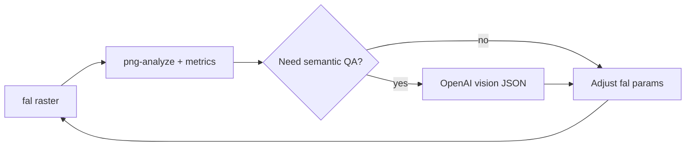

# Tools (Node / server-side)

Scripts in this directory run **only on the machine or CI that invokes Node** — they are **not** part of the Vite bundle and **must not** be shipped to GitHub Pages. Keep API keys such as **`FAL_KEY`** and **`OPENAI_API_KEY`** in environment variables or secret stores; do not embed them in `src/` or client code.

## npm scripts (entry points)

| Script (`npm run …`) | Node entry file |
|---------------------|-------------------|
| **`generate:raster`** | `tools/fal-raster-generate.mjs` |
| **`dpad-workflow`** | `tools/dpad-workflow.mjs` |
| **`mock:dpad-workflow`** | `tools/dpad-workflow.mjs --mode mock` (same as `npm run dpad-workflow -- --mode mock`) |
| **`analyze:png`** | `tools/png-analyze.mjs` |
| **`qa:vision`** | `tools/openai-vision-qa.mjs` |

**`npm test`** runs Vitest (`vitest run`) and already picks up **`tools/**/*.test.mjs`** via **`vitest.config.ts`** `test.include` (alongside `src/**/*.test.ts`). No separate **`test:tools`** script is required for discoverability. See [Vitest coverage (tools)](#vitest-coverage-tools) below.

Pass CLI flags after `--`, e.g. `npm run analyze:png -- src/art/fixtures/sample-grid-atlas.png --sprite-width 32 --sprite-height 32`.

### `dpad-workflow` and mock pipeline

**`dpad-workflow.mjs`** is the CLI for the D-pad tile workflow. Implementation lives under **[`tools/sprite-generation/`](sprite-generation/)**: it delegates to **`runPipeline`** ([`pipeline.mjs`](sprite-generation/pipeline.mjs)) and the D-pad preset **[`presets/dpad.mjs`](sprite-generation/presets/dpad.mjs)** (`createPreset`). Manifest and outputs under `public/art/dpad/`, one PNG per direction, `png-analyze` QA via the sprite-generation stack, verbose STDOUT.

- **`npm run dpad-workflow`** — `node tools/dpad-workflow.mjs` (default **`--mode mock`**).
- **`npm run mock:dpad-workflow`** — `node tools/dpad-workflow.mjs --mode mock` (explicit mock entry point).
- **`tools/mock-dpad-workflow.mjs`** — thin shim that spawns `dpad-workflow.mjs --mode mock`; prefer the npm scripts above.

**`--mode generate`** defaults to **`--strategy sheet`**: one **512×512** fal image, then **deterministic 2×2 crops** to 256² tiles (**shared style**, not guaranteed directional semantics or transparency—see `.cursor/plans/fal-precision-assets.md` §4.1). **`--strategy per-tile`**: legacy four API calls. See `--help`.

## `tools/sprite-generation/` (sprite generation pipeline library)

Layout (Node-only; not shipped to the client bundle):

```text
sprite-generation/
  pipeline.mjs
  generators/          # fal, mock, shared types
  postprocess/         # e.g. chroma-key, png-region
  qa/                  # analysis bridges, integration hooks
  presets/             # workflow presets (e.g. dpad)
```

Supporting modules at the library root include **`manifest.mjs`**, **`prompt.mjs`**, **`sprite-ref.mjs`**, and **`logging.mjs`**. The D-pad CLI wires these together; see **[`presets/dpad.mjs`](sprite-generation/presets/dpad.mjs)** for preset-specific defaults and **`dpad-workflow.mjs`** for the user-facing entry.

### Vitest coverage (tools)

- Tests live next to code as **`tools/**/*.test.mjs`** (and `src/**/*.test.ts` for app code). **`vitest.config.ts`** sets `test.include` accordingly.
- Tests use mocks, fixtures, and deterministic helpers — **no live image generation** in the test suite.

## fal vs OpenAI (roles)

- **fal** — spritesheet-oriented **raster** generation (exact `image_size` where the model allows); **you** pack/slice into a grid or atlas. Use **`FAL_KEY`**.
- **OpenAI** — non-fal image generation, **vision/QA**, and chat; use **`OPENAI_API_KEY`**. Do not use OpenAI image APIs for the same “spritesheet raster” slot as fal unless the team explicitly changes the plan.

**Secrets and client bundle:** **`FAL_KEY`** and **`OPENAI_API_KEY`** must **not** use `VITE_*` and must **not** appear in the GitHub Pages **client** bundle. After `npm run build`, `rg FAL_KEY dist/` and `rg OPENAI_API_KEY dist/` should print **no** matches (keys stay in Node/CI only).

### Iteration loop (fal → measure → optional vision → fal)



**Observability (each round):** log **wall-clock time**, **token/cost** line items when the APIs return them (`usage` on OpenAI; fal queue logs where applicable), and **parameter deltas** between fal runs (`seed`, `image_size`, `num_images`, prompt, endpoint).

See **`.cursor/plans/project-implementation-deep-dive.md`** §E.0, §E.5.1.

## `fal-raster-generate.mjs`

Calls the fal Model API for text-to-image raster output using **`FAL_KEY`** (or **`FAL_KEY_ID`** + **`FAL_KEY_SECRET`**) from the environment.

- **Endpoint id** (pinned in the script, from the model’s `/api` page): **`fal-ai/flux/dev`**.
- **Writes** generated rasters to **`tools/out/raster/`** by default (`--out-dir` overrides). That directory is gitignored; create it on first run.

Example:

```bash
export FAL_KEY="…"
npm run generate:raster -- --prompt "pixel art hero idle, transparent background" --image-size 512x512 --num-images 1 --output-format png
```

See **`../.cursor/plans/project-implementation-deep-dive.md`** §E.3.1 for `image_size`, `num_images`, `output_format`, and `seed` semantics.

**Troubleshooting:** If the API returns **403 Forbidden**, run the script again: it prints the JSON **`detail`** from fal (the raw client often only showed `Forbidden`). A common case is **exhausted balance** — add credits at [fal.ai/dashboard/billing](https://fal.ai/dashboard/billing). Confirm the key works with the [authentication docs](https://fal.ai/docs/model-apis/authentication) curl example (`fal-ai/flux/schnell`).

## `png-analyze.mjs`

Deterministic PNG checks for CI and **fal → measure** loops (**§E.5**, **§E.5.1**): width/height, file size, alpha coverage with a **256-bin histogram**, axis-aligned bbox of pixels with alpha **> 0**, and optional **grid projection** vs `--sprite-width` / `--sprite-height` (remainder mod cell size, divisibility, mean luma edge energy on internal grid lines).

**Premultiplied alpha:** If sprites show wrong fringes vs the engine, compare exporter vs Excalibur expectations and fix in **export** or **one** normalization step—see **§C.4** (same checklist this tool supports by surfacing raw alpha distribution and opaque bounds).

**Exit codes:** **0** = success (JSON on stdout). **1** = invalid arguments or missing path (message + `--help` on stderr). **2** = file read error or PNG decode failure.

**Help:** `npm run analyze:png -- --help`

Example (uses checked-in grid fixture):

```bash
npm run analyze:png -- src/art/fixtures/sample-grid-atlas.png --sprite-width 32 --sprite-height 32
```

## `openai-vision-qa.mjs`

Optional **semantic** QA on a raster using **OpenAI Chat Completions** only (REST via `fetch` — no `openai` SDK in this repo). Inputs include a **base64 data URL** image; outputs are **structured JSON** (`response_format` **json_schema**, `strict: true`) for machine-readable fields aligned with §E.5.1.

- **API surface:** **Chat Completions** (`/v1/chat/completions`) — not the Responses API.
- **Model:** **`OPENAI_VISION_MODEL`** (default **`gpt-4o`**), chosen to support **vision + structured outputs** together.
- If **`OPENAI_API_KEY`** is unset, the script **exits 0** and prints a clear **skipped** message (deterministic + fal-only workflows still run in CI without keys).

Sending pixels to OpenAI is **third-party processing** — review [OpenAI policies](https://openai.com/policies/) and [API — Your data](https://developers.openai.com/api/docs/guides/your-data) before enabling in your environment.

Example:

```bash
export OPENAI_API_KEY="…"
npm run qa:vision -- src/art/fixtures/sample-grid-atlas.png --detail low
```

Stdout is JSON: `structured` (schema fields), `usage` (when present), `wall_clock_ms`, `model`, `api`.
